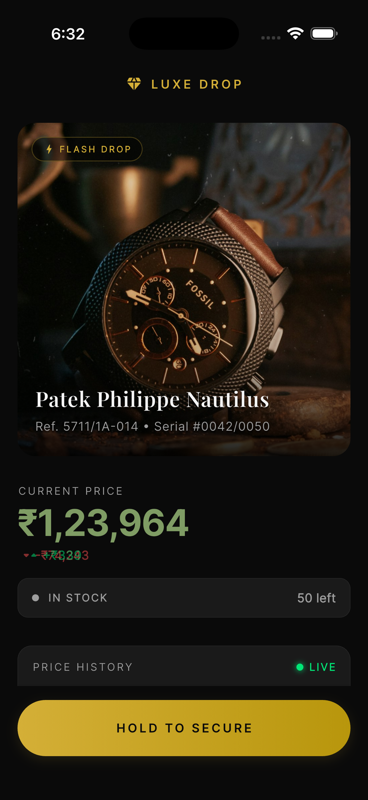
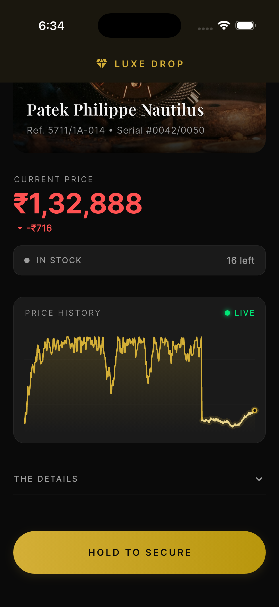

# 💎 LuxeDrop

A premium **Flash Drop** product detail page built with Flutter — featuring real-time price fluctuations, a custom-painted live chart, and an animated "Hold to Secure" purchase flow.

> **Built for 60 FPS** with isolate-based JSON parsing, granular BLoC rebuilds, and zero-allocation chart painting.

---

## 📱 Screenshots

<p align="center">
  
  &nbsp;&nbsp;&nbsp;&nbsp;
  
</p>

---

## ✨ Features

- **Real-Time Price Streaming** — Live price ticks every 800ms with animated transitions (green ↑ / red ↓)
- **Custom Live Chart** — `CustomPainter`-drawn line chart with cubic bezier curves, gradient fill, and a glowing live-data overlay
- **Hold to Secure Button** — 3-state animated CTA: idle → hold (progress ring) → purchased (elastic checkmark)
- **50K Data Point Parsing** — Historical bid data parsed in a **Dart Isolate** to keep the UI thread free
- **Shimmer Loading** — Skeleton placeholders while data parses off-thread
- **Inventory Tracking** — Real-time stock counter with urgency states (In Stock → Selling Fast → Almost Gone → Sold Out)
- **Expandable Specs** — Collapsible product details with animated reveal

---

## 🏗️ Architecture

**Feature-first Clean Architecture** with three layers:

```
lib/
├── main.dart
├── app.dart
├── core/                           # Theme, constants, utilities
└── features/flash_drop/
    ├── data/                       # Datasources, models, repo impl
    ├── domain/                     # Entities, abstract repo, use cases
    └── presentation/              # BLoC, pages, widgets
```

| Layer | Responsibility |
|-------|---------------|
| **Data** | Mock WebSocket stream, JSON asset reader, `Isolate.run()` for parsing |
| **Domain** | Pure entities, repository contract, `FlashDropUseCase` |
| **Presentation** | `FlashDropBloc` (BLoC pattern), granular `BlocSelector` widgets |

> For a detailed architecture breakdown, see [ARCHITECTURE.md](ARCHITECTURE.md).

---

## ⚡ Performance Optimizations

| Optimization | Impact |
|-------------|--------|
| `Isolate.run()` for 50K JSON parse | Zero main-thread blocking during data load |
| `BlocSelector` per widget | Only affected widgets rebuild on each price tick |
| Pre-downsampled chart data (50K → 300 pts) | Computed once in BLoC, not every frame |
| Rolling 100-point live price window | Prevents unbounded list growth |
| `static final` Paint objects in `CustomPainter` | Eliminates ~480 allocations/sec |
| Equatable props use `.length` for static lists | Avoids deep-comparing 50K items every 800ms |
| `RepaintBoundary` on static widgets | Isolates repaint scope from live data |
| Google Fonts pre-loaded with `await pendingFonts()` | No network-triggered re-layout jank |
| Theme cached as `static final` | `GoogleFonts.xxx()` called once, not per access |

---

## 🚀 Getting Started

### Prerequisites

- Flutter SDK `^3.10.4`
- Dart SDK `^3.10.4`
- iOS Simulator / Android Emulator / Physical device

### Run the app

```bash
# Install dependencies
flutter pub get

# Run in debug mode
flutter run

# Run in profile mode (recommended for perf testing)
flutter run --profile
```

---

## 📦 Dependencies

| Package | Purpose |
|---------|---------|
| [`flutter_bloc`](https://pub.dev/packages/flutter_bloc) | BLoC state management |
| [`equatable`](https://pub.dev/packages/equatable) | Value equality for states & events |
| [`google_fonts`](https://pub.dev/packages/google_fonts) | Playfair Display + Inter typography |
| [`shimmer`](https://pub.dev/packages/shimmer) | Skeleton loading placeholders |
| [`intl`](https://pub.dev/packages/intl) | INR currency formatting |
| [`http`](https://pub.dev/packages/http) | HTTP client (architecture placeholder) |

---

## 📂 Key Files

| File | What it does |
|------|-------------|
| `lib/main.dart` | Entry point — pre-caches Google Fonts before first frame |
| `lib/features/.../bloc/flash_drop_bloc.dart` | Event-driven state management with price throttling |
| `lib/features/.../widgets/live_chart_painter.dart` | Custom `CustomPainter` with pre-allocated paints |
| `lib/features/.../widgets/hold_to_secure_button.dart` | 3-state animated purchase button |
| `lib/features/.../pages/flash_drop_page.dart` | Main page with granular `BlocSelector` rebuilds |
| `lib/features/.../data/repositories/flash_drop_repository_impl.dart` | Isolate-based JSON parsing |

---

## 📄 License

This project is for demonstration purposes only.
